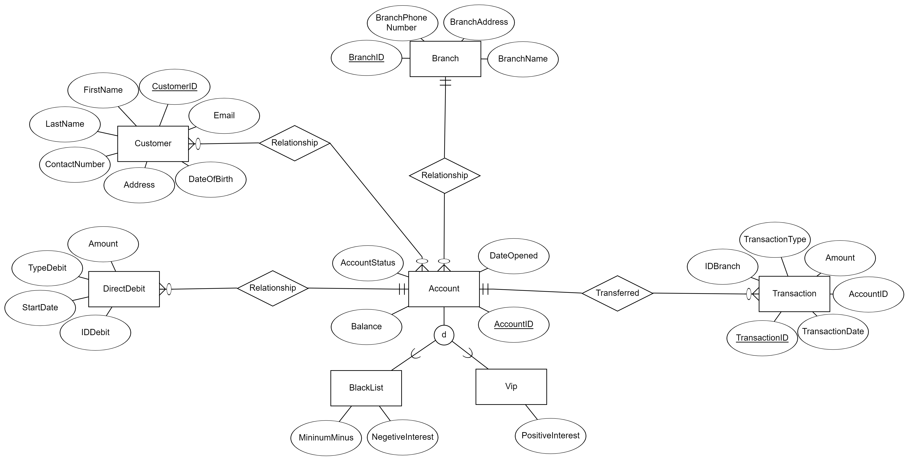

# databases

## Table of Contents

1. [Description of the Organization](#description-of-the-organization)
2. [Entity-Relationship Diagram (ERD)](#entity-relationship-diagram-erd)
3. [Data Structure Diagram (DSD)](#data-structure-diagram-dsd)
4. [Organization's Entities and Relationships](#organizations-entities-and-relationships)
5. [Create Table Script](#create-table-script)
6. [Data Entry](#data-entry)
7. [Drop Table Script](#drop-table-script)
8. [Backup and Test](#backup-and-test)

## Description of the Organization

The organization under consideration is a banking institution known as XYZ Bank. XYZ Bank is a reputable financial institution with a wide range of services catering to individuals, businesses, and organizations. Established in [year], XYZ Bank has been serving customers for [number] years, providing comprehensive banking solutions, including savings and checking accounts, loans, investments, and financial advisory services.

XYZ Bank operates through a network of branches strategically located across [region/country], ensuring accessibility and convenience for its customers. With a strong focus on customer satisfaction, XYZ Bank prides itself on delivering exceptional banking experiences and personalized services to meet the diverse needs of its clientele.

In addition to its traditional banking services, XYZ Bank has embraced technological advancements to offer online banking platforms and mobile applications, allowing customers to manage their accounts, conduct transactions, and access banking services conveniently from anywhere, at any time.

Overall, XYZ Bank is committed to upholding the highest standards of integrity, professionalism, and innovation in the banking industry, striving to be the preferred financial partner for individuals and businesses alike.

## Entity-Relationship Diagram (ERD)

The Entity-Relationship Diagram (ERD) for the Accounts wing of XYZ Bank illustrates the entities and their relationships within the database schema.

## Database Schema

### Customer
  - The Customer entity represents the bank's customers who hold accounts with the bank.
    **Attributes:**
    - **CustomerID (Primary Key):** Unique identifier for the customer.
    - **FirstName:** First name of the customer.
    - **LastName:** Last name of the customer.
    - **DateOfBirth:** Date of birth of the customer.
    - **Address:** Address of the customer.
    - **ContactNumber:** Contact number of the customer.
    - **Email:** Email address of the customer.

### Account
  - The Account entity represents the bank accounts held by customers.
    **Attributes:**
    - **AccountID (Primary Key):** Unique identifier for the account.
    - **Balance:** Current balance of the account.
    - **DateOpened:** Date when the account was opened.
    - **AccountStatus:** Status of the account (e.g., active, closed).

### Transaction
  - The Transaction entity represents the transactions associated with customer accounts.
    **Attributes:**
    - **TransactionID (Primary Key):** Unique identifier for the transaction.
    - **AccountID (Foreign Key):** References the AccountID of the associated account.
    - **TransactionType:** Type of the transaction (e.g., deposit, withdrawal).
    - **Amount:** Amount involved in the transaction.
    - **TransactionDate:** Date when the transaction occurred.

### Branch
  - The Branch entity represents the bank branches where customers can access banking services.
    **Attributes:**
    - **BranchID (Primary Key):** Unique identifier for the branch.
    - **BranchName:** Name of the branch.
    - **BranchAddress:** Address of the branch.
    - **BranchPhoneNumber:** Phone number of the branch.

### DirectDebit
  - The DirectDebit entity represents the direct debit arrangements set up by customers for recurring payments.
    **Attributes:**
    - **IDDebit (Primary Key):** Unique identifier for the direct debit.
    - **StartDate:** Start date of the direct debit.
    - **TypeDebit:** Type of the direct debit.
    - **Amount:** Amount of the direct debit.
    - **IDAccount (Foreign Key):** References the AccountID of the associated account.
    - **IDBranch (Foreign Key):** References the BranchID of the associated branch.

### Vip (Inherits from Customer)
  - The Vip entity represents VIP customers who have special privileges and benefits.
    **Attributes:**
    - Inherits all attributes from Customer.
    - **PositiveInterest:** Interest rate applied to VIP accounts.

### BlackList (Inherits from Customer)
  - The BlackList entity represents customers who have been blacklisted due to certain reasons.
    **Attributes:**
    - Inherits all attributes from Customer.
    - **NegetiveInterest:** Interest rate applied to BlackList accounts.
    - **MinimumMinus:** Minimum balance allowed for BlackList accounts.

## Relationships
  - **Customer and Account:** Many-to-Many (A customer can have multiple accounts and an account can belong to multiple customers). 
  - **Account and Transaction:** One-to-Many (An account can have multiple transactions but a transaction belongs to only one account).
  - **Branch and Account:** One-to-Many (A branch can have multiple accounts but an account belongs to only one branch).
  - **Account and DirectDebit:** One-to-Many (An account can have multiple direct debits but a direct debit belongs to only one account).
  - **Customer** is the superclass of **Vip** and **BlackList**. These entities inherit attributes from the Customer entity.

## Data Structure Diagram (DSD)

The Data Structure Diagram (DSD) is derived from the Entity-Relationship Diagram (ERD) and represents the logical structure of the database. It outlines the tables, fields, and relationships in a hierarchical manner.

[Insert DSD image here]

You can include the DSD image to visually represent the database structure. Adjust the explanations and relationships according to your specific requirements. Let me know if you need further clarification or assistance!

