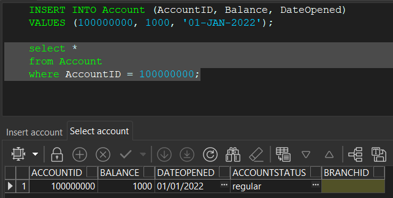

# databases

### presented by: **Account Department**

- head of team: **Evyatar Baruch**
- head scientist: **Ephraim Levi**
- head of database: **Yehuda Pilant**

## Table of Contents

[Stage One](#stage-one)

1. [Description of the Organization](#description-of-the-organization)

2. [Entity-Relationship Diagram (ERD)](#entity-relationship-diagram-erd)

3. [Data Structure Diagram (DSD)](#data-structure-diagram-dsd)

4. [Database Schema](#database-schema)
   <details>
   <summary>Subsections</summary>

   - [Customer](#customer)
   - [Account](#account)
   - [Transaction](#transaction)
   - [Branch](#branch)
   - [Direct Debit](#directdebit)
   - [VIP](#vip-inherits-from-customer)
   - [Blacklist](#blacklist-inherits-from-customer)

   </details>

5. [Relationships](#relationships)

6. [Third Normal Form (3NF)](#third-normal-form-3nf)

7. [Create Table Script](#create-table-script)
   <details>
   <summary>Subsections</summary>

   - [DESC Command](#desc-command)
   - [Tables](#tables)

   </details>

8. [Data Entry](#data-entry)

9. [Drop Table Script](#drop-table-script)

10. [Backup and Test](#backup-and-test)

[Stage Two](#stage-two)

1. [Alters](#alters)

2. [Parameterless Queries](#parameterless-queries)
   <details>
   <summary>Subsections</summary>

   - [4 Select Queries](#4-select-queries)
   - [2 Delete Queries](#2-delete)
   - [2 Update Queries](#2-update)

   </details>

3. [Parameterized Queries](#parameterized-queries)

4. [Constraints](#constraints)
      <details>
      <summary>Subsections</summary>

   - [NOT NULL Constraint](#not-null-constraint)
   - [UNIQUE Constraint](#unique-constraint)
   - [DEFAULT Constraint](#default-constraint)
   - [CHECK Constraint](#check-constraint)

      </details>
   [StageThree](#stage-three)

5. [General Description](#general-description)
6. [Code](#code)
   <details>
   <summary>Subsections</summary>

   - [Functions](#functions)
   - [Procedures](#procedures)
   - [Triggers](#triggers)
   - [Mains](#mains)
   
   </details>
7. [Testing](#testing)
8. [Backup](#backup)

# Stage One

## Description of the Organization

The organization under consideration is a banking institution known as XYZ Bank. XYZ Bank is a reputable financial institution with a wide range of services catering to individuals, businesses, and organizations. Established in [year], XYZ Bank has been serving customers for [number] years, providing comprehensive banking solutions, including savings and checking accounts, loans, investments, and financial advisory services.

XYZ Bank operates through a network of branches strategically located across [region/country], ensuring accessibility and convenience for its customers. With a strong focus on customer satisfaction, XYZ Bank prides itself on delivering exceptional banking experiences and personalized services to meet the diverse needs of its clientele.

In addition to its traditional banking services, XYZ Bank has embraced technological advancements to offer online banking platforms and mobile applications, allowing customers to manage their accounts, conduct transactions, and access banking services conveniently from anywhere, at any time.

Overall, XYZ Bank is committed to upholding the highest standards of integrity, professionalism, and innovation in the banking industry, striving to be the preferred financial partner for individuals and businesses alike.

## Entity-Relationship Diagram (ERD)

The Entity-Relationship Diagram (ERD) for the Accounts wing of XYZ Bank illustrates the entities and their relationships within the database schema.


.png>)

## Database Schema

### Customer

- The Customer entity represents the bank's customers who hold accounts with the bank.

  **Attributes:**

  - **CustomerID (Primary Key):** Unique identifier for the customer.
  - **FirstName:** First name of the customer.
  - **LastName:** Last name of the customer.
  - **DateOfBirth:** Date of birth of the customer.
  - **Address:** Address of the customer.
  - **ContactNumber:** Contact number of the customer.
  - **Email:** Email address of the customer.

### Account

- The Account entity represents the bank accounts held by customers.

  **Attributes:**

  - **AccountID (Primary Key):** Unique identifier for the account.
  - **Balance:** Current balance of the account.
  - **DateOpened:** Date when the account was opened.
  - **AccountStatus:** Status of the account (e.g., active, closed).

### Transaction

- The Transaction entity represents the transactions associated with customer accounts.

  **Attributes:**

  - **TransactionID (Primary Key):** Unique identifier for the transaction.
  - **AccountID (Foreign Key):** References the AccountID of the associated account.
  - **TransactionType:** Type of the transaction (e.g., deposit, withdrawal).
  - **Amount:** Amount involved in the transaction.
  - **TransactionDate:** Date when the transaction occurred.

### Branch

- The Branch entity represents the bank branches where customers can access banking services.

  **Attributes:**

  - **BranchID (Primary Key):** Unique identifier for the branch.
  - **BranchName:** Name of the branch.
  - **BranchAddress:** Address of the branch.
  - **BranchPhoneNumber:** Phone number of the branch.

### DirectDebit

- The DirectDebit entity represents the direct debit arrangements set up by customers for recurring payments.

  **Attributes:**

  - **IDDebit (Primary Key):** Unique identifier for the direct debit.
  - **StartDate:** Start date of the direct debit.
  - **TypeDebit:** Type of the direct debit.
  - **Amount:** Amount of the direct debit.
  - **IDAccount (Foreign Key):** References the AccountID of the associated account.
  - **IDBranch (Foreign Key):** References the BranchID of the associated branch.

### Vip (Inherits from Customer)

- The Vip entity represents VIP customers who have special privileges and benefits.

  **Attributes:**

  - Inherits all attributes from Customer.
  - **PositiveInterest:** Interest rate applied to VIP accounts.

### BlackList (Inherits from Customer)

- The BlackList entity represents customers who have been blacklisted due to certain reasons.

  **Attributes:**

  - Inherits all attributes from Customer.
  - **NegetiveInterest:** Interest rate applied to BlackList accounts.
  - **MinimumMinus:** Minimum balance allowed for BlackList accounts.

## Relationships

- **Customer and Account:** Many-to-Many (A customer can have multiple accounts and an account can belong to multiple customers).
- **Account and Transaction:** One-to-Many (An account can have multiple transactions but a transaction belongs to only one account).
- **Branch and Account:** One-to-Many (A branch can have multiple accounts but an account belongs to only one branch).
- **Account and DirectDebit:** One-to-Many (An account can have multiple direct debits but a direct debit belongs to only one account).
- **Customer** is the superclass of **Vip** and **BlackList**. These entities inherit attributes from the Customer entity.

## Data Structure Diagram (DSD)

The Data Structure Diagram (DSD) is derived from the Entity-Relationship Diagram (ERD) and represents the logical structure of the database. It outlines the tables, fields, and relationships in a hierarchical manner.

| Account       | Data Type  | Nullability |
| ------------- | ---------- | ----------- |
| AccountID     | NUMBER(38) | NOT NULL    |
| Balance       | NUMBER     | NOT NULL    |
| DateOpened    | DATE       | NOT NULL    |
| AccountStatus | VARCHAR2   | NOT NULL    |
| BranchID      | NUMBER(38) |             |

| Customer      | Data Type  | Nullability |
| ------------- | ---------- | ----------- |
| CustomerID    | NUMBER(38) | NOT NULL    |
| FirstName     | VARCHAR2   | NOT NULL    |
| LastName      | VARCHAR2   | NOT NULL    |
| DateOfBirth   | DATE       | NOT NULL    |
| Address       | VARCHAR2   | NOT NULL    |
| ContactNumber | NUMBER     | NOT NULL    |
| Email         | VARCHAR2   | NOT NULL    |

| Transaction     | Data Type  | Nullability |
| --------------- | ---------- | ----------- |
| TransactionID   | NUMBER(38) | NOT NULL    |
| TransactionType | VARCHAR2   | NOT NULL    |
| Amount          | NUMBER     | NOT NULL    |
| TransactionDate | DATE       | NOT NULL    |
| AccountID       | NUMBER(38) |             |

| Branch            | Data Type  | Nullability |
| ----------------- | ---------- | ----------- |
| BranchID          | NUMBER(38) | NOT NULL    |
| BranchName        | VARCHAR2   | NOT NULL    |
| BranchAddress     | VARCHAR2   | NOT NULL    |
| BranchPhoneNumber | NUMBER     | NOT NULL    |

| DirectDebit | Data Type  | Nullability |
| ----------- | ---------- | ----------- |
| IDDebit     | NUMBER(38) | NOT NULL    |
| StartDate   | DATE       | NOT NULL    |
| TypeDebit   | VARCHAR2   | NOT NULL    |
| Amount      | NUMBER     | NOT NULL    |
| AccountID   | NUMBER(38) |             |

| Vip                                | Data Type  | Nullability |
| ---------------------------------- | ---------- | ----------- |
| AccountID (Inherits from Customer) | NUMBER(38) | NOT NULL    |
| PositiveInterest                   | FLOAT      | NOT NULL    |

| BlackList                          | Data Type  | Nullability |
| ---------------------------------- | ---------- | ----------- |
| AccountID (Inherits from Customer) | NUMBER(38) | NOT NULL    |
| NegetiveInterest                   | FLOAT      | NOT NULL    |
| MinimumMinus                       | NUMBER     | NOT NULL    |

| Rel5       | Data Type  | Nullability |
| ---------- | ---------- | ----------- |
| CustomerID | NUMBER(38) | NOT NULL    |
| AccountID  | NUMBER(38) | NOT NULL    |


### tables

> The tables in the database are as follows:
> 

## Data Entry

> The data entry process involves inserting records into the tables of the database. This can be done manually or through automated scripts.

[here](StageOne/StageOne/Scripts/insertTables.sql)

### data generator images

#### Costumer Table

> 

> 

#### Account Table

> 

> 

#### Transaction Table

> 

> 

#### Branch Table

> 

> 

#### Direct Debit Table

> 

> 

#### VIP Table

> 

> 

#### BlackList Table

> 

> 

#### Rel5 Table

> 

> 

### Mockaroo images

#### Direct Debit Table

> 

> 

#### Transaction Table

> 

> 

## Drop Table Script

> The drop table script is used to remove tables from the database. It includes the table name and the command to drop the table.

[here](StageOne/StageOne/Scripts/dropTables.sql)

## Backup and Test

> The backup and test process involves creating a backup of the database and testing the database to ensure that it is functioning correctly.

- Backup SQL script:
  [here](StageOne/Scripts/backupSql.sql)

- Backup PL/SQL script:
  [here](StageOne/Scripts/backupPlSql.sql)

- Backup pde script:
  [here](StageOne/Scripts/backupPLSQL.pde)

# Stage Two

## alters

1. **Alter the Rel5 Table Name:**

   The Rel5 table is used to establish a many-to-many relationship between the Customer and Account tables. However, the name "Rel5" does not provide meaningful information about the relationship it represents. To improve clarity and maintain consistency in naming conventions, the table name can be altered to a more descriptive name, such as "Relationship."

   ```sql
   ALTER TABLE Rel5 RENAME TO Relationship;
   ```

## parameterless queries

### 4 select queries

1. **Query 1:**

   Story: The bank wants to identify customers who have account balances greater than the 90th percentile balance for each branch. This information can help the bank identify high-balance customers and offer them personalized services or investment opportunities.

   sql explanation: The query retrieves the first name, last name, account balance, branch name, and branch address for customers who have account balances greater than the 90th percentile balance for each branch. The subquery calculates the 90th percentile balance for each branch using the PERCENTILE_DISC function within a group. The main query filters customers based on their account balances exceeding the calculated 90th percentile balance for their respective branches.

   syntax explanation: The query uses the SELECT statement to retrieve specific columns from the Customer, Account, and Branch tables. It includes a correlated subquery within the WHERE clause to filter customers based on their account balances exceeding the 90th percentile balance for each branch. The results are ordered by account balance in descending order.

   ```sql
   SELECT c.FirstName, c.LastName, a.Balance, b.BranchName, b.BranchAddress
   FROM Customer c JOIN Relationship r ON c.CustomerID = r.CustomerID JOIN Account a ON r.AccountID = a.AccountID JOIN Branch b ON a.BranchID = b.BranchID
   WHERE a.Balance > (
         SELECT PERCENTILE_DISC(0.9) WITHIN GROUP (ORDER BY a2.Balance) -- Calculate the 90th percentile balance for each branch
         FROM Account a2
         WHERE a2.BranchID = a.BranchID
       )
   ORDER BY
     a.Balance DESC;
   ```

   

   file: [here](StageTwo/select1.sql)

2. **Query 2:**

   Story: The bank wants to generate a report of transactions made by customers within the last 24 months. This report should include the customer's first name, last name, transaction date, transaction type, and transaction amount. The bank can use this information to analyze customer transaction patterns and identify trends.

   sql explanation: The query retrieves the first name, last name, transaction date, transaction type, and amount for transactions made by customers within the last 24 months. It joins the Transactions, Account, Relationship, and Customer tables to link transactions to customers. The WHERE clause filters transactions based on the transaction date falling within the specified date range. The results are ordered by customer last name, first name, and transaction date in descending order.

   syntax explanation: The query uses the SELECT statement to retrieve specific columns from the Transactions, Account, Relationship, and Customer tables. It includes JOIN operations to link transactions to customers through the Account and Relationship tables. The WHERE clause filters transactions based on the transaction date falling within the last 24 months. The results are ordered by customer last name, first name, and transaction date in descending order.

   ```sql
   SELECT  c.FirstName, c.LastName, t.TransactionDate, t.TransactionType, t.Amount
   FROM Transactions t JOIN Account a ON t.AccountID = a.AccountID JOIN Relationship r ON a.AccountID = r.AccountID JOIN Customer c ON r.CustomerID = c.CustomerID
   WHERE t.TransactionDate BETWEEN ADD_MONTHS(SYSDATE, -24) AND SYSDATE
   ORDER BY c.LastName, c.FirstName, t.TransactionDate DESC;
   ```

   

   file: [here](StageTwo/select2.sql)

3. **Query 3:**

   ```sql
   SELECT b.BranchName, b.BranchAddress, SUM(a.Balance) AS TotalBalance, COUNT(a.AccountID) AS AccountCount
   FROM Branch b JOIN  Account a ON b.BranchID = a.BranchID
   WHERE a.DateOpened BETWEEN ADD_MONTHS(SYSDATE, -24) AND SYSDATE
   GROUP BY b.BranchName, b.BranchAddress
   ORDER BY TotalBalance DESC;
   ```

   

   file: [here](StageTwo/select3.sql)

4. **Query 4:**

   Story: The bank wants to identify customers who have VIP accounts but have not made any transactions. This information can help the bank identify inactive VIP customers and reach out to them to encourage account activity.

   sql explanation: The query retrieves the first name, last name, account balance, and positive interest rate for VIP customers who have not made any transactions. It joins the Customer, Relationship, Account, and VIP tables to link customers to their VIP accounts. The WHERE clause uses a NOT EXISTS subquery to filter customers who have no transactions associated with their accounts. The results are ordered by customer last name and first name.

   syntax explanation: The query uses the SELECT statement to retrieve specific columns from the Customer, Account, and VIP tables. It includes JOIN operations to link customers to their VIP accounts through the Relationship table. The WHERE clause uses a NOT EXISTS subquery to filter customers who have no transactions associated with their accounts. The results are ordered by customer last name and first name.

   ```sql
   SELECT c.FirstName, c.LastName, a.Balance, v.PositiveInterest
   FROM Customer c JOIN Relationship r ON c.CustomerID = r.CustomerID JOIN Account a ON r.AccountID = a.AccountID JOIN Vip v ON a.AccountID = v.AccountID
   WHERE NOT EXISTS (
       SELECT 1
       FROM Transactions t
       WHERE t.AccountID = a.AccountID
   )
   ORDER BY c.LastName, c.FirstName;
   ```

   

   file: [here](StageTwo/select4.sql)

### 2 delete

1. **Delete Query 1:**

   Story: The bank wants to remove customers from the blacklist whose negative interest rates are below the 25th percentile negative interest rate. This action is necessary to maintain an updated blacklist of customers with significant negative balances.

   sql explanation: The query deletes customers from the BlackList table whose negative interest rates are below the 25th percentile negative interest rate. It uses a subquery to calculate the 25th percentile negative interest rate within the BlackList table and filters customers based on their negative interest rates being lower than the calculated threshold.

   syntax explanation: The query uses the DELETE statement to remove records from the BlackList table based on a specified condition. It includes a subquery to calculate the 25th percentile negative interest rate within the BlackList table. The WHERE clause filters customers based on their negative interest rates being lower than the calculated threshold.

   ```sql
   DELETE FROM BlackList
   WHERE NEGETIVEINTEREST < (
       SELECT PERCENTILE_DISC(0.25) WITHIN GROUP (ORDER BY NEGETIVEINTEREST) -- Calculate the 25th percentile negative interest
       FROM
       BlackList
       );
   ```

   

   This query deletes customers from the BlackList table whose negative interest rates are below the 25th percentile negative interest rate. It uses a subquery to calculate the 25th percentile negative interest rate within the BlackList table and filters customers based on their negative interest rates being lower than the calculated threshold.

   file: [here](StageTwo/delete1.sql)

2. **Delete Query 2:**

   Story: The bank wants to remove direct debit arrangements for accounts that are closed. This action is necessary to ensure that direct debits are not processed for accounts that are no longer active.

   sql explanation: The query deletes direct debit arrangements from the DirectDebit table for accounts that are closed. It uses a subquery to retrieve AccountIDs of closed accounts from the Account table and filters direct debits based on the associated AccountIDs.

   syntax explanation: The query uses the DELETE statement to remove records from the DirectDebit table based on a specified condition. It includes a subquery to retrieve AccountIDs of closed accounts from the Account table. The WHERE clause filters direct debits based on the associated AccountIDs of closed accounts.

   ```sql
   DELETE FROM DirectDebit
   WHERE AccountID IN (
       SELECT AccountID
       FROM Account
       WHERE AccountStatus = 'closed'
       );
   ```

   

   This query deletes direct debit arrangements from the DirectDebit table for accounts that are closed. It uses a subquery to retrieve AccountIDs of closed accounts from the Account table and filters direct debits based on the associated AccountIDs.

   file: [here](StageTwo/delete2.sql)

### 2 update

1. **Update Query 1:**

   story: The bank wants to update the contact numbers of customers who have accounts opened more than 20 years ago. This update is necessary to ensure that customer contact information is up-to-date and accurate.

   sql explanation: The query updates the contact numbers of customers who have accounts opened more than 20 years ago. It uses a subquery to retrieve CustomerIDs of customers with accounts opened before the specified date and updates their contact numbers.

   syntax explanation: The query uses the UPDATE statement to modify the contact numbers of customers based on a specified condition. It includes a subquery to retrieve CustomerIDs of customers with accounts opened more than 20 years ago. The SET clause updates the contact numbers for those customers.

   ```sql
   UPDATE Customer
   SET ContactNumber = '0000000000'
   WHERE CustomerID IN (
                         SELECT c.CustomerID
                         FROM Customer c JOIN Relationship r ON c.CustomerID = r.CustomerID JOIN Account a ON r.AccountID = a.AccountID
                         WHERE a.DateOpened < ADD_MONTHS(SYSDATE, -240)
                         );

   ```

   

   This query updates the contact numbers of customers who have accounts opened more than 20 years ago. It uses a subquery to retrieve CustomerIDs of customers with accounts opened before the specified date and updates their contact numbers.

   file: [here](StageTwo/update1.sql)

2. **Update Query 2:**

   Story: The bank wants to increase the positive interest rates for VIP customers who have maintained high balances and made significant transactions in the last 24 months. This update is intended to reward loyal customers and encourage them to continue their banking activities.

   sql explanation: The query updates the PositiveInterest attribute for VIP customers who have maintained high balances and made significant transactions in the last 24 months. It uses a subquery to retrieve AccountIDs of customers who meet the specified criteria and increments their PositiveInterest by 0.5.

   syntax explanation: The query uses the UPDATE statement to modify the PositiveInterest attribute for VIP customers based on a specified condition. It includes a subquery to retrieve AccountIDs of customers who have maintained high balances and made significant transactions in the last 24 months. The SET clause increments the PositiveInterest by 0.5 for those customers.

   ```sql
   UPDATE Vip
   SET PositiveInterest = PositiveInterest + 0.5
   WHERE AccountID IN (
                       SELECT a.AccountID
                       FROM Account a JOIN Transactions t ON a.AccountID = t.AccountID
                       WHERE a.Balance > 10000 AND t.TransactionDate BETWEEN ADD_MONTHS(SYSDATE, -24) AND SYSDATE
                       );
   ```

   

   This query updates the PositiveInterest attribute for VIP customers who have maintained high balances and made significant transactions in the last 24 months. It uses a subquery to retrieve AccountIDs of customers who meet the specified criteria and increments their PositiveInterest by 0.5.

   file: [here](StageTwo/update2.sql)

## parameterized queries

1. **Query 1:**

   Story: The bank wants to identify VIP customers who have made a significant number of transactions above a certain amount within a given date range. This information can be used to offer special promotions or rewards to these valuable customers.

   ```sql
   SELECT v.AccountID, c.FirstName || ' ' || c.LastName AS CustomerName, v.PositiveInterest,
      (SELECT COUNT(*)
      FROM Transactions t
      WHERE t.AccountID = v.AccountID
      AND t.Amount > &<name = "min Transaction Amount" hint = "Specify the minimum transaction amount">
      AND t.TransactionDate BETWEEN TO_DATE('&<name="Start Date" type="date" list="SELECT TO_CHAR(TransactionDate, 'YYYY-MM-DD') FROM (SELECT TransactionDate FROM Transactions ORDER BY TransactionDate) WHERE ROWNUM <= (SELECT MAX(ROWNUM) FROM (SELECT TransactionDate FROM Transactions ORDER BY TransactionDate))" hint = "Select the start date for the date range">', 'YYYY-MM-DD') AND TO_DATE('&<name="End Date" type="date" list="SELECT TO_CHAR(TransactionDate, 'YYYY-MM-DD') FROM (SELECT TransactionDate FROM Transactions ORDER BY TransactionDate) WHERE ROWNUM <= (SELECT MAX(ROWNUM) FROM (SELECT TransactionDate FROM Transactions ORDER BY TransactionDate))"  hint = "Select the end date for the date range">', 'YYYY-MM-DD')) AS TransactionCount
      FROM Vip v
      JOIN Relationship r ON v.AccountID = r.AccountID
      JOIN Customer c ON r.CustomerID = c.CustomerID
      WHERE EXISTS (
                     SELECT 1
                     FROM Transactions t
                     WHERE t.AccountID = v.AccountID
                     AND t.Amount > &<name = "min Transaction Amount" hint = "Specify the minimum transaction amount">
                     AND t.TransactionDate BETWEEN TO_DATE('&<name="Start Date" type="date" list="SELECT TO_CHAR(TransactionDate, 'YYYY-MM-DD') FROM (SELECT TransactionDate FROM Transactions ORDER BY TransactionDate) WHERE ROWNUM <= (SELECT MAX(ROWNUM) FROM (SELECT TransactionDate FROM Transactions ORDER BY TransactionDate))" hint = "Select the start date for the date range">', 'YYYY-MM-DD') AND TO_DATE('&<name="End Date" type="date" list="SELECT TO_CHAR(TransactionDate, 'YYYY-MM-DD') FROM (SELECT TransactionDate FROM Transactions ORDER BY TransactionDate) WHERE ROWNUM <= (SELECT MAX(ROWNUM) FROM (SELECT TransactionDate FROM Transactions ORDER BY TransactionDate))"  hint = "Select the end date for the date range">', 'YYYY-MM-DD')
                     );
   ```

   
   

   This query retrieves the CustomerID, PositiveInterest, and a count of transactions (TransactionCount) for VIP customers who have made transactions above a certain amount (Minimum Transaction Amount) within a given date range (Start Date and End Date). The correlated subquery in the WHERE clause filters only those VIP customers who have at least one transaction meeting the criteria.

   file: [here](StageTwo/ParamsQueries.sql)

2. **Query 2:**

   _Story_: The bank wants to analyze the performance of its branches by identifying the number of active accounts and the total balance held in each branch for specific cities. This information can help the bank make strategic decisions about resource allocation and branch operations.

   ```sql
   SELECT /*+ LEADING(b) USE_NL(b a) */
      b.BranchName, b.BranchAddress,
      (SELECT /*+ PARALLEL(a, 4) */
      COUNT(*)
      FROM Account a
      WHERE a.BranchID = b.BranchID
         AND a.AccountStatus != 'closed') AS ActiveAccounts,
      (SELECT /*+ PARALLEL(a, 4) */
      SUM(a.Balance)
      FROM Account a
      WHERE a.BranchID = b.BranchID
         AND a.AccountStatus != 'closed') AS TotalBalance
   FROM Branch b
   WHERE b.BranchAddress IN (&<name="Cities" type="string" list="SELECT BranchAddress FROM Branch ORDER BY BranchAddress" multiselect="yes" hint="Select the cities">);
   ```

   
   

   This query retrieves the BranchName, BranchAddress, the count of active accounts (ActiveAccounts), and the total balance of active accounts (TotalBalance) for branches located in specific cities (Cities). The subqueries calculate the active account count and total balance for each branch. The user can select multiple cities from a list using the multiselect option.

   file: [here](StageTwo/ParamsQueries.sql)

3. **Query 3:**

   _Story_: The bank wants to identify blacklisted customers who have accounts with negative balances exceeding a certain threshold. This information can help the bank take appropriate actions, such as requesting payment, imposing additional fees, or potentially closing those accounts. The query retrieves the AccountID, NegetiveInterest, MinimumMinus, NegativeBalance (if it exists below the specified threshold), and the CustomerName for blacklisted customers who have accounts with negative balances below the specified threshold.

   ```sql
   SELECT c.CustomerID, c.FirstName, c.LastName,
      (SELECT /*+ PARALLEL(a, 4) */
      SUM(a.Balance)
      FROM Account a
      WHERE EXISTS (SELECT 1
                     FROM Relationship r
                     WHERE r.CustomerID = c.CustomerID
                        AND r.AccountID = a.AccountID)) AS CumulativeBalance,
      (SELECT /*+ PARALLEL(a, 4) */
      COUNT(*)
      FROM Account a
      WHERE EXISTS (SELECT 1
                     FROM Relationship r
                     WHERE r.CustomerID = c.CustomerID
                        AND r.AccountID = a.AccountID)) AS AccountCount
   FROM Customer c
   WHERE (
         SELECT /*+ PARALLEL(a, 4) */
         SUM(a.Balance)
         FROM Account a
         WHERE EXISTS (SELECT 1
                        FROM Relationship r
                        WHERE r.CustomerID = c.CustomerID
                           AND r.AccountID = a.AccountID)
         ) > &<name="Cumulative Balance Threshold" type="float" hint="Enter the cumulative balance threshold">;
   ```

   
   

   This query retrieves the CustomerID, NegetiveInterest, MinimumMinus, and the negative balance (NegativeBalance) for blacklisted customers who have an account with a balance less than the negative balance threshold (Negative Balance Threshold). The correlated subquery in the WHERE clause filters only those blacklisted customers who have at least one account meeting the negative balance criteria.

   file: [here](StageTwo/select3.sql)

4. **Query 4:**

   _Story_: The bank wants to identify customers whose cumulative balance across all their accounts exceeds a certain threshold. This information can be used for targeted marketing campaigns or to offer special services to high-net-worth customers.

   ```sql
   SELECT
      bl.AccountID,
      c.FirstName || ' ' || c.LastName AS CustomerName,
      bl.NegetiveInterest,
      bl.MinimumMinus,
      (
         SELECT /*+ PARALLEL(a, 4) */
         a.Balance
         FROM Account a
         WHERE a.AccountID = bl.AccountID
         AND a.Balance < -&<name="Negative Balance Threshold" type="float" hint="Enter the negative balance threshold">
      ) AS NegativeBalance
   FROM
      BlackList bl
   JOIN
      Relationship r ON bl.AccountID = r.AccountID
   JOIN
      Customer c ON r.CustomerID = c.CustomerID
   WHERE
      EXISTS (
         SELECT /*+ PARALLEL(a, 4) */
         1
         FROM Account  a
         WHERE a.AccountID = bl.AccountID
         AND a.Balance < -&<name="Negative Balance Threshold" type="float" hint="Enter the negative balance threshold">
      );
   ```

   
   

   This query retrieves the CustomerID, FirstName, LastName, and the cumulative balance (CumulativeBalance) for customers whose cumulative balance across all their accounts exceeds the specified threshold (Cumulative Balance Threshold). The subquery calculates the cumulative balance by summing the balances of all accounts linked to the customer through the Relationship table. The WHERE clause filters only those customers whose cumulative balance exceeds the threshold.

   file: [here](StageTwo/ParamsQueries.sql)

## constraints

1. **NOT NULL Constraint:**

   > The NOT NULL constraint ensures that a column cannot contain NULL values. It enforces the presence of a value in the column, preventing it from being empty.

   we already have the `NOT NULL` constraint on all the atrributes in the tables that are required to have a value.

   

> trying to insert a record with a null value in a column with a NOT NULL constraint will result in an error, for example:

```sql
 INSERT INTO Customer (CustomerID, FirstName, LastName, DateOfBirth, Address, ContactNumber, Email)
 VALUES (1, 'John', 'Doe', '01-JAN-1990', '123 Main Street', NULL, '[email protected]');
```

    [image](StageTwo/Photos/Not_Null_Error.png)

2. **UNIQUE Constraint:**

   > The UNIQUE constraint ensures that all values in a column are unique and not duplicated. It enforces the uniqueness of values within the column, preventing duplicate entries.

   adding a UNIQUE constraint to the `Email` column in the `Customer` table.

   ```sql
   ALTER TABLE Customer
   ADD CONSTRAINT UniqueEmail UNIQUE (Email);
   ```

   > trying to insert a record with a duplicate value in a column with a UNIQUE constraint will result in an error, for example:

   ```sql
    INSERT INTO Customer (CustomerID, FirstName, LastName, DateOfBirth, Address, ContactNumber, Email)
    VALUES (2, 'Jane', 'Doe', '01-JAN-1995', '456 Elm Street', 1234567890, '[email protected]');

    INSERT INTO Customer (CustomerID, FirstName, LastName, DateOfBirth, Address, ContactNumber, Email)
    VALUES (3, 'Alice', 'Smith', '01-JAN-1985', '789 Oak Street', 9876543210, '[email protected]');
   ```

   

3. **DEFAULT Constraint:**

   > The DEFAULT constraint specifies a default value for a column when no value is provided during insertion. It assigns a predefined value to the column if no other value is specified.

   adding a DEFAULT constraint to the `AccountStatus` column in the `Account` table to be set to some valid status if no value is provided(the statuses are 'soldier','elderly','regular','student','foreign' , 'minor' , and lastly 'closed' but an account can't be opened with this status).

   ```sql

   ALTER TABLE Account
   MODIFY AccountStatus VARCHAR2(20) DEFAULT 'regular';
   ```

   > trying to insert a record without providing a value for the `AccountStatus` column will result in the default value being assigned, for example:

   ```sql
    INSERT INTO Account (AccountID, Balance, DateOpened)
    VALUES (100000000, 1000, '01-JAN-2022');

    select *
    from Account
    where AccountID = 100000000;
   ```

   

4. **CHECK Constraint:**

   > The CHECK constraint defines a condition that must be satisfied for the data to be inserted or updated in the column. It allows the specification of a logical expression that restricts the values that can be stored in the column.

   adding a CHECK constraint to the `Amount` column in the `Transaction` table to ensure that the amount is greater than zero.

   ```sql
   ALTER TABLE Transactions
   ADD CONSTRAINT CheckAmount CHECK (Amount > 0);
   ```

   > trying to insert a record with a value that violates the CHECK constraint will result in an error, for example:

   ```sql
    INSERT INTO Transactions (TransactionID, AccountID, TransactionType, Amount, TransactionDate)
    VALUES (1, 100000000, 'deposit', -100, '01-JAN-2022');
   ```

   

## commits and rollbacks Explanation

Commits and rollbacks are used to manage transactions in the database.
A commit is used to save the changes made in a transaction, while a rollback is used to undo the changes made in a transaction. If a commit is executed, the changes are permanently saved in the database. If a rollback is executed, the changes are undone, and the database is restored to its previous state.

# Stage Three

## General description

this stage is about creating a PL/SQL package that contains procedures and functions to perform various operations on the database. The package includes the following elements:

- **Functions:**

  - **GetRecentTransactions:** This function retrieves the most recent transactions from the Transactions table based on the specified number of transactions to return.

  [here](StageThree/Functions/Function1%20-%20get_recent_transactions.fnc)

  - **GetCustomerTotalBalance:** This function calculates the total balance of a specific customer based on the CustomerID.

  [here](StageThree/Functions/Function2%20-%20get_customer_total_balance.fnc)

  - **GetCustomerDetailsFromAccount:** This function retrieves customer details based on the AccountID.

  [here](StageThree/Functions/Function3%20-%20get_customer_details_from_account.fnc)

- **Procedures:**

  - **CreateCustomerAndAccount:** This procedure creates a new customer and account in the database. It takes input parameters for the customer details and account balance.

  [here](StageThree/Procedures/Procedure1%20-%20create_customer_and_account.prc)

  - **TransferMoney:** This procedure transfers a specified amount of money from one account to another. It takes input parameters for the source and destination account IDs and the amount to transfer.
    [here](StageThree/Procedures/Procedure2%20-%20transfer_money.prc)

**triggers:**

-**Transaction Triggeer ID:** This trigger automatically generates a unique TransactionID for each new transaction inserted into the Transactions table.

[here](StageThree/Triggers/trg_generate_transaction_id.trg)

-**Account Trigger ID:** This trigger automatically generates a unique AccountID for each new account inserted into the Account table.

[here](StageThree/Triggers/trg_generate_account_id.trg)

-**Customer Trigger ID:** This trigger automatically generates a unique CustomerID for each new customer inserted into the Customer table.

[here](StageThree/Triggers/trg_generate_customer_id.trg)

-**Branch Trigger ID:** This trigger automatically generates a unique BranchID for each new branch inserted into the Branch table.

(note: not used because the branches are not unique for each customer)

[here](StageThree/Triggers/trg_generate_branch_id.trg)

-**Direct Debit Trigger ID:** This trigger automatically generates a unique IDDebit for each new direct debit arrangement inserted into the DirectDebit table.

[here](StageThree/Triggers/trg_generate_directdebit_id.trg)

## Code

### Functions:

1. **GetRecentTransactions:**

```sql
/*
  Function Name: get_recent_transactions
  Purpose:
    This function retrieves recent transactions for a given account within a specified number of days.
  Parameters:
    p_account_id (IN NUMBER) - The ID of the account for which recent transactions are to be retrieved.
    p_days (IN NUMBER) - The number of past days to consider for retrieving transactions.
  Returns:
    SYS_REFCURSOR - A cursor containing the transaction details (TransactionID, TransactionType, Amount, TransactionDate).
  Usage:
    This function can be called by passing an account ID and the number of days to retrieve recent transactions.
  Features Used:
    a. Ref Cursor - Used to return the result set of recent transactions.
    b. Exception Handling - Used to catch and log any errors that occur during the execution of the function.
  Notes:
    - This function performs a SELECT operation on the Transactions table.
    - Proper exception handling ensures that errors are logged and handled gracefully.
    - The function assumes that the structure of the Transactions table is known and correct.
*/

CREATE OR REPLACE FUNCTION get_recent_transactions(p_account_id IN NUMBER, p_days IN NUMBER)
RETURN SYS_REFCURSOR
IS
    v_transactions SYS_REFCURSOR;
BEGIN
    OPEN v_transactions FOR
        SELECT TransactionID, TransactionType, Amount, TransactionDate
        FROM Transactions
        WHERE AccountID = p_account_id
          AND TransactionDate >= SYSDATE - p_days
        ORDER BY TransactionDate DESC;

    RETURN v_transactions;
EXCEPTION
    WHEN OTHERS THEN
        DBMS_OUTPUT.PUT_LINE('Error in get_recent_transactions: ' || SQLERRM);
        RETURN NULL;
END;
```

2. **GetCustomerTotalBalance:**

```sql
CREATE OR REPLACE FUNCTION get_customer_total_balance(p_customer_id IN NUMBER)
RETURN NUMBER
IS
    -- Variable to store the total balance of all accounts for the given customer
    v_total_balance NUMBER := 0;

    -- Variable to store the positive interest rate for VIP accounts
    v_positive_interest NUMBER := 0;

    -- Explicit cursor to fetch account details for the given customer
    CURSOR c_accounts IS
        SELECT a.AccountID, a.Balance
        FROM Account a
        JOIN Relationship r ON a.AccountID = r.AccountID
        WHERE r.CustomerID = p_customer_id;

    -- Record variable to hold a row fetched by the cursor
    v_account_record c_accounts%ROWTYPE;

BEGIN
    DBMS_OUTPUT.PUT_LINE('Fetching accounts for customer ID: ' || p_customer_id);

    -- Open the cursor to begin fetching rows
    OPEN c_accounts;

    -- Loop to fetch each account's balance and update the total balance
    LOOP
        FETCH c_accounts INTO v_account_record;
        EXIT WHEN c_accounts%NOTFOUND;

        DBMS_OUTPUT.PUT_LINE('Processing account ID: ' || v_account_record.AccountID || ', Balance: ' || v_account_record.Balance);

        -- Add the current account's balance to the total balance
        v_total_balance := v_total_balance + v_account_record.Balance;
        DBMS_OUTPUT.PUT_LINE('Updated total balance: ' || v_total_balance);

        -- Apply interest for VIP accounts
        BEGIN
            -- Fetch the positive interest rate for the current account if it is a VIP account
            SELECT PositiveInterest
            INTO v_positive_interest
            FROM Vip
            WHERE AccountID = v_account_record.AccountID;

            DBMS_OUTPUT.PUT_LINE('Applying interest for VIP account ID: ' || v_account_record.AccountID || ', Interest rate: ' || v_positive_interest);

            -- Apply the interest rate to the total balance
            v_total_balance := v_total_balance * (1 + v_positive_interest);
            DBMS_OUTPUT.PUT_LINE('Total balance after applying interest: ' || v_total_balance);
        EXCEPTION
            -- Handle the case where the current account is not a VIP account
            WHEN NO_DATA_FOUND THEN
                DBMS_OUTPUT.PUT_LINE('Account ID ' || v_account_record.AccountID || ' is not a VIP account.');
                NULL; -- No interest for non-VIP accounts
        END;
    END LOOP;

    -- Close the cursor after fetching all rows
    CLOSE c_accounts;

    DBMS_OUTPUT.PUT_LINE('Final total balance for customer ID ' || p_customer_id || ': ' || v_total_balance);
    DBMS_OUTPUT.NEW_LINE;

    -- Return the total balance
    RETURN v_total_balance;

EXCEPTION
    -- Handle any other exceptions that occur
    WHEN OTHERS THEN
        DBMS_OUTPUT.PUT_LINE('Error in get_customer_total_balance: ' || SQLERRM);
        RETURN NULL;
END get_customer_total_balance;
```

3. **GetCustomerDetailsFromAccount:**

```sql
CREATE OR REPLACE FUNCTION get_customer_details_from_account(p_account_id IN NUMBER)
RETURN SYS_REFCURSOR
IS
    v_customer_details SYS_REFCURSOR;
    v_customer_count NUMBER;
    v_is_vip BOOLEAN := FALSE;

    -- Define a record type for customer details
    TYPE r_customer IS RECORD (
        CustomerID NUMBER,
        FirstName VARCHAR2(100),
        LastName VARCHAR2(100),
        LinkedAccountCount NUMBER
    );
    v_customer r_customer;
BEGIN
    -- Check if the account is a VIP account
    BEGIN
        SELECT 1 INTO v_customer_count
        FROM Vip
        WHERE AccountID = p_account_id;
        v_is_vip := TRUE;
    EXCEPTION
        WHEN NO_DATA_FOUND THEN
            v_is_vip := FALSE;
    END;

    -- Get customer details
    OPEN v_customer_details FOR
        SELECT r.CustomerID, c.FirstName, c.LastName, (
            SELECT COUNT(*)
            FROM Relationship
            WHERE CustomerID = r.CustomerID
        ) AS linked_account_count
        FROM Relationship r
        JOIN Customer c ON r.CustomerID = c.CustomerID
        WHERE r.AccountID = p_account_id
        ORDER BY c.DateOfBirth ASC
        FETCH FIRST 1 ROWS ONLY;

    -- Fetch and process customer details
    FETCH v_customer_details INTO v_customer;

    -- Log customer details
    DBMS_OUTPUT.PUT_LINE('Customer ID: ' || v_customer.CustomerID);
    DBMS_OUTPUT.PUT_LINE('Name: ' || v_customer.FirstName || ' ' || v_customer.LastName);
    DBMS_OUTPUT.PUT_LINE('Linked Accounts: ' || v_customer.LinkedAccountCount);

    IF v_is_vip THEN
        DBMS_OUTPUT.PUT_LINE('This is a VIP account');
    ELSE
        DBMS_OUTPUT.PUT_LINE('This is a regular account');
    END IF;

    -- Reopen the cursor for returning
    OPEN v_customer_details FOR
        SELECT r.CustomerID, c.FirstName, c.LastName, (
            SELECT COUNT(*)
            FROM Relationship
            WHERE CustomerID = r.CustomerID
        ) AS linked_account_count
        FROM Relationship r
        JOIN Customer c ON r.CustomerID = c.CustomerID
        WHERE r.AccountID = p_account_id
        ORDER BY c.DateOfBirth ASC
        FETCH FIRST 1 ROWS ONLY;

    RETURN v_customer_details;
EXCEPTION
    WHEN OTHERS THEN
        DBMS_OUTPUT.PUT_LINE('Error in get_customer_details_from_account: ' || SQLERRM);
        RETURN NULL;
END get_customer_details_from_account;
```

### Procedures:

1. **CreateCustomerAndAccount:**

```sql
/*
  Procedure Name: create_customer_and_account
  Purpose:
    This procedure creates a new customer and a new account for the customer,
    links the customer to the account, and records the initial deposit transaction.
    If the customer already exists, it creates a new account for the customer.
  Parameters:
    p_first_name (IN VARCHAR2) - First name of the customer.
    p_last_name (IN VARCHAR2) - Last name of the customer.
    p_dob (IN DATE) - Date of birth of the customer.
    p_address (IN VARCHAR2) - Address of the customer.
    p_contact_number (IN NUMBER) - Contact number of the customer.
    p_email (IN VARCHAR2) - Email of the customer.
    p_initial_deposit (IN NUMBER) - Initial deposit amount for the account.
    p_branch_id (IN NUMBER) - Branch ID where the account is created.
  Features Used:
    a. DML Commands - Uses INSERT to add new records to Customer, Account, Relationship, and Transactions tables.
    b. Exception Handling - Used to catch and log any errors that occur during the execution of the procedure.
    c. Triggers - Uses triggers to generate unique IDs for Customer, Account, and Transactions.
  Notes:
    - This procedure assumes the existence of triggers named 'trg_generate_customer_id', 'trg_generate_account_id', and 'trg_generate_transaction_id' for generating unique IDs.
    - Proper exception handling ensures that errors are logged and handled gracefully.
*/

CREATE OR REPLACE PROCEDURE create_customer_and_account(
  p_first_name IN VARCHAR2,
  p_last_name IN VARCHAR2,
  p_dob IN DATE,
  p_address IN VARCHAR2,
  p_contact_number IN NUMBER,
  p_email IN VARCHAR2,
  p_initial_deposit IN NUMBER,
  p_branch_id IN NUMBER
)
IS
  v_customer_id NUMBER;
  v_account_id NUMBER;
BEGIN
  -- Check if the customer already exists
  BEGIN
    SELECT CustomerID INTO v_customer_id
    FROM Customer
    WHERE FirstName = p_first_name
      AND LastName = p_last_name
      AND DateOfBirth = p_dob
      AND ContactNumber = p_contact_number;

    DBMS_OUTPUT.PUT_LINE('Existing customer found with ID: ' || v_customer_id);
  EXCEPTION
    WHEN NO_DATA_FOUND THEN
      -- Customer does not exist, create a new customer
      INSERT INTO Customer (FirstName, LastName, DateOfBirth, Address, ContactNumber, Email)
      VALUES (p_first_name, p_last_name, p_dob, p_address, p_contact_number, p_email)
      RETURNING CustomerID INTO v_customer_id;

      DBMS_OUTPUT.PUT_LINE('New customer created successfully.');
      DBMS_OUTPUT.PUT_LINE('Customer ID: ' || v_customer_id);
  END;

  -- Create new account
  INSERT INTO Account (Balance, DateOpened, AccountStatus, BranchID)
  VALUES (p_initial_deposit, SYSDATE, 'ACTIVE', p_branch_id)
  RETURNING AccountID INTO v_account_id;

  DBMS_OUTPUT.PUT_LINE('New account created successfully.');
  DBMS_OUTPUT.PUT_LINE('Account ID: ' || v_account_id);

  -- Link customer to account
  INSERT INTO Relationship (CustomerID, AccountID)
  VALUES (v_customer_id, v_account_id);

  DBMS_OUTPUT.PUT_LINE('Customer linked to account successfully.');
  DBMS_OUTPUT.NEW_LINE;

  -- Record initial deposit transaction
  INSERT INTO Transactions (AccountID, TransactionType, Amount, TransactionDate)
  VALUES (v_account_id, 'DEPOSIT', p_initial_deposit, SYSDATE);

  DBMS_OUTPUT.PUT_LINE('Initial deposit transaction recorded successfully.');
  DBMS_OUTPUT.PUT_LINE('Initial deposit amount: ' || p_initial_deposit);

  -- Commit the transaction
  COMMIT;

  DBMS_OUTPUT.PUT_LINE('Customer and account creation process completed successfully.');
  DBMS_OUTPUT.PUT_LINE('Customer ID: ' || v_customer_id);
  DBMS_OUTPUT.PUT_LINE('Account ID: ' || v_account_id);
  DBMS_OUTPUT.NEW_LINE;
EXCEPTION
  WHEN OTHERS THEN
    DBMS_OUTPUT.PUT_LINE('Error in create_customer_and_account: ' || SQLERRM);
    ROLLBACK;
    DBMS_OUTPUT.PUT_LINE('Transaction rolled back due to error.');
END create_customer_and_account;
```

2. **TransferMoney:**

```sql
/*
  Procedure Name: transfer_money
  Purpose:
    This procedure transfers money from one account to another and records the transactions.
  Parameters:
    p_from_account (IN NUMBER) - The ID of the account from which money is to be transferred.
    p_to_account (IN NUMBER) - The ID of the account to which money is to be transferred.
    p_amount (IN NUMBER) - The amount of money to be transferred.
  Features Used:
    a. DML Commands - Uses INSERT to record transactions and UPDATE to adjust account balances.
    b. Exception Handling - Used to catch and log any errors that occur during the execution of the procedure.
    c. Trigger - Uses a trigger to generate unique transaction IDs.
  Notes:
    - This procedure assumes the existence of a trigger named 'trg_generate_transaction_id' for generating unique transaction IDs.
    - Proper exception handling ensures that errors are logged and handled gracefully.
    - Informative output is added to provide feedback on the transaction process.
*/

CREATE OR REPLACE PROCEDURE transfer_money (
    p_from_account IN NUMBER,
    p_to_account IN NUMBER,
    p_amount IN NUMBER
)
IS
BEGIN
    -- Deduct the amount from the source account
    UPDATE Account
    SET Balance = Balance - p_amount
    WHERE AccountID = p_from_account;
    DBMS_OUTPUT.PUT_LINE('Deducted ' || p_amount || ' from account ' || p_from_account);

    -- Add the amount to the destination account
    UPDATE Account
    SET Balance = Balance + p_amount
    WHERE AccountID = p_to_account;
    DBMS_OUTPUT.PUT_LINE('Added ' || p_amount || ' to account ' || p_to_account);

    -- Record the outgoing transaction
    INSERT INTO Transactions (AccountID, TransactionType, Amount, TransactionDate)
    VALUES (p_from_account, 'TRANSFER_OUT', p_amount, SYSDATE);
    DBMS_OUTPUT.PUT_LINE('Recorded outgoing transaction for account ' || p_from_account);
    DBMS_OUTPUT.NEW_LINE;

    -- Record the incoming transaction
    INSERT INTO Transactions (AccountID, TransactionType, Amount, TransactionDate)
    VALUES (p_to_account, 'TRANSFER_IN', p_amount, SYSDATE);
    DBMS_OUTPUT.PUT_LINE('Recorded incoming transaction for account ' || p_to_account);

    -- Commit the transaction
    COMMIT;
    DBMS_OUTPUT.PUT_LINE('Transaction committed successfully.');
    DBMS_OUTPUT.NEW_LINE;
EXCEPTION
    -- Handle any exceptions that occur
    WHEN OTHERS THEN
        DBMS_OUTPUT.PUT_LINE('Error in transfer_money: ' || SQLERRM);
        ROLLBACK;
        DBMS_OUTPUT.PUT_LINE('Transaction rolled back due to error.');
END transfer_money;
```

### Triggers:

1. **Transaction Triggeer ID:**

```sql
CREATE OR REPLACE TRIGGER trg_generate_transaction_id
BEFORE INSERT ON Transactions
FOR EACH ROW
BEGIN
    SELECT COALESCE(MAX(TransactionID), 0) + 1 INTO :NEW.TransactionID FROM Transactions;
END;
```

2. **Account Trigger ID:**

```sql
CREATE OR REPLACE TRIGGER trg_generate_account_id
BEFORE INSERT ON Account
FOR EACH ROW
BEGIN
    SELECT COALESCE(MAX(AccountID), 0) + 1 INTO :NEW.AccountID FROM Account;
END;
```

3. **Customer Trigger ID:**

```sql
CREATE OR REPLACE TRIGGER trg_generate_customer_id
BEFORE INSERT ON Customer
FOR EACH ROW
BEGIN
    SELECT COALESCE(MAX(CustomerID), 0) + 1 INTO :NEW.CustomerID FROM Customer;
END;
```

### Mains

1. **Main 1:**

```sql
CREATE OR REPLACE PROCEDURE new_customer_and_transactions(
  p_first_name IN VARCHAR2,
  p_last_name IN VARCHAR2,
  p_dob IN DATE,
  p_address IN VARCHAR2,
  p_phone IN NUMBER,
  p_email IN VARCHAR2,
  p_initial_deposit IN NUMBER,
  p_branch_id IN NUMBER
)
IS
  v_customer_id NUMBER;
  v_account_id NUMBER;
  v_transactions SYS_REFCURSOR;
  v_transaction_id NUMBER;
  v_transaction_type VARCHAR2(50);
  v_amount NUMBER;
  v_transaction_date DATE;
  v_total_amount NUMBER := 0;
  v_transaction_count NUMBER := 0;
BEGIN
  DBMS_OUTPUT.PUT_LINE('Starting new_customer_and_transactions procedure...');
  DBMS_OUTPUT.NEW_LINE;

  -- Validate BranchID
  BEGIN
    DECLARE
      v_temp_branch_id NUMBER;
    BEGIN
      SELECT BranchID INTO v_temp_branch_id
      FROM Branch
      WHERE BranchID = p_branch_id;
    EXCEPTION
      WHEN NO_DATA_FOUND THEN
        DBMS_OUTPUT.PUT_LINE('Error: Invalid BranchID provided.');
        RETURN;
    END;
  END;

  -- Create new customer and account
  create_customer_and_account(
    p_first_name, p_last_name, p_dob,
    p_address, p_phone, p_email,
    p_initial_deposit, p_branch_id  -- Use the provided BranchID
  );

  -- Get the newly created customer and account IDs
  BEGIN
    SELECT c.CustomerID, r.AccountID
    INTO v_customer_id, v_account_id
    FROM Customer c
    JOIN Relationship r ON c.CustomerID = r.CustomerID
    WHERE c.FirstName = p_first_name AND c.LastName = p_last_name
    AND ROWNUM = 1;
  EXCEPTION
    WHEN NO_DATA_FOUND THEN
      DBMS_OUTPUT.PUT_LINE('Error: Unable to find the newly created customer and account.');
      RETURN;
  END;

  -- Log customer and account creation success
  DBMS_OUTPUT.PUT_LINE('New customer created successfully.');
  DBMS_OUTPUT.PUT_LINE('Customer ID: ' || v_customer_id);
  DBMS_OUTPUT.PUT_LINE('New account created successfully.');
  DBMS_OUTPUT.PUT_LINE('Account ID: ' || v_account_id);
  DBMS_OUTPUT.NEW_LINE;

  -- End of Manager-like section

  -- Get recent transactions
  v_transactions := get_recent_transactions(v_account_id, 30);

  DBMS_OUTPUT.PUT_LINE('Recent transactions for the new account:');
  LOOP
    FETCH v_transactions INTO v_transaction_id, v_transaction_type, v_amount, v_transaction_date;
    EXIT WHEN v_transactions%NOTFOUND;

    v_total_amount := v_total_amount + v_amount;
    v_transaction_count := v_transaction_count + 1;

    DBMS_OUTPUT.PUT_LINE(
      'Transaction ID: ' || v_transaction_id ||
      ', Type: ' || v_transaction_type ||
      ', Amount: $' || v_amount ||
      ', Date: ' || TO_CHAR(v_transaction_date, 'YYYY-MM-DD')
    );
  END LOOP;
  CLOSE v_transactions;

  DBMS_OUTPUT.NEW_LINE;
  DBMS_OUTPUT.PUT_LINE('Transaction summary:');
  DBMS_OUTPUT.PUT_LINE('Total number of transactions: ' || v_transaction_count);
  DBMS_OUTPUT.PUT_LINE('Total amount of transactions: $' || v_total_amount);
  IF v_transaction_count > 0 THEN
    DBMS_OUTPUT.PUT_LINE('Average transaction amount: $' || ROUND(v_total_amount / v_transaction_count, 2));
  ELSE
    DBMS_OUTPUT.PUT_LINE('Average transaction amount: $0 (No transactions)');
  END IF;

  DBMS_OUTPUT.NEW_LINE;
  DBMS_OUTPUT.PUT_LINE('new_customer_and_transactions procedure completed.');
EXCEPTION
  WHEN OTHERS THEN
    DBMS_OUTPUT.PUT_LINE('Error in new_customer_and_transactions: ' || SQLERRM);
    ROLLBACK;
END;
```

2. **Main 2:**

```sql
CREATE OR REPLACE PROCEDURE main_transfer_and_balance (
    p_transfer_amount NUMBER,
    p_from_account_id NUMBER,
    p_to_account_id NUMBER
)
IS
    v_total_balance NUMBER;
    v_from_balance NUMBER;
    v_to_balance NUMBER;
    v_customer_id Customer.CustomerID%TYPE;
    v_customer_firstname Customer.FirstName%TYPE;
    v_customer_lastname Customer.LastName%TYPE;
    v_linked_account_count NUMBER;
    v_customer_details SYS_REFCURSOR;
    CURSOR c_check_balances IS
        SELECT AccountID, Balance
        FROM Account
        WHERE AccountID IN (p_from_account_id, p_to_account_id);
    v_account_record c_check_balances%ROWTYPE;
    v_transfer_successful BOOLEAN := FALSE;
BEGIN
    DBMS_OUTPUT.PUT_LINE('Starting main_transfer_and_balance procedure...');
    -- Step 1: Check balances of both accounts
    OPEN c_check_balances;
    LOOP
        FETCH c_check_balances INTO v_account_record;
        EXIT WHEN c_check_balances%NOTFOUND;
        IF v_account_record.AccountID = p_from_account_id THEN
            v_from_balance := v_account_record.Balance;
        ELSIF v_account_record.AccountID = p_to_account_id THEN
            v_to_balance := v_account_record.Balance;
        END IF;
    END LOOP;
    CLOSE c_check_balances;

    DBMS_OUTPUT.PUT_LINE('Initial balances:');
    DBMS_OUTPUT.PUT_LINE('From account (ID ' || p_from_account_id || '): $' || v_from_balance);
    DBMS_OUTPUT.PUT_LINE('To account (ID ' || p_to_account_id || '): $' || v_to_balance);
    DBMS_OUTPUT.NEW_LINE;

    -- Step 2: Check if the transfer is valid and proceed
    IF v_from_balance >= p_transfer_amount THEN
        DBMS_OUTPUT.PUT_LINE('Proceeding with the transfer of $' || p_transfer_amount);
        BEGIN
            transfer_money(p_from_account_id, p_to_account_id, p_transfer_amount);
            v_transfer_successful := TRUE;
        EXCEPTION
            WHEN OTHERS THEN
                v_transfer_successful := FALSE;
                DBMS_OUTPUT.PUT_LINE('Transfer failed: ' || SQLERRM);
        END;

        IF v_transfer_successful THEN
            -- Recalculate balances
            SELECT Balance INTO v_from_balance FROM Account WHERE AccountID = p_from_account_id;
            SELECT Balance INTO v_to_balance FROM Account WHERE AccountID = p_to_account_id;

            DBMS_OUTPUT.PUT_LINE('Updated balances:');
            DBMS_OUTPUT.PUT_LINE('From account (ID ' || p_from_account_id || '): $' || v_from_balance);
            DBMS_OUTPUT.PUT_LINE('To account (ID ' || p_to_account_id || '): $' || v_to_balance);
            DBMS_OUTPUT.NEW_LINE;

            -- Step 3: Fetch customer details using cursor
            v_customer_details := get_customer_details_from_account(p_from_account_id);
            FETCH v_customer_details INTO v_customer_id, v_customer_firstname, v_customer_lastname, v_linked_account_count;
            CLOSE v_customer_details;

            IF v_customer_id IS NOT NULL THEN
                DBMS_OUTPUT.PUT_LINE('Customer details for Account ' || p_from_account_id || ':');
                DBMS_OUTPUT.PUT_LINE('Customer ID: ' || v_customer_id);
                DBMS_OUTPUT.PUT_LINE('Name: ' || v_customer_firstname || ' ' || v_customer_lastname);
                DBMS_OUTPUT.PUT_LINE('Number of linked accounts: ' || v_linked_account_count);

                -- Calculate total balance for the customer
                v_total_balance := get_customer_total_balance(v_customer_id);
                DBMS_OUTPUT.PUT_LINE('Total balance across all accounts: $' || v_total_balance);
            ELSE
                DBMS_OUTPUT.PUT_LINE('No customer found linked to Account ' || p_from_account_id);
            END IF;
        ELSE
            DBMS_OUTPUT.PUT_LINE('Transfer was not successful. Customer details will not be displayed.');
        END IF;
    ELSE
        DBMS_OUTPUT.PUT_LINE('Error: Insufficient funds in the from account (ID ' || p_from_account_id || ').');
    END IF;

    DBMS_OUTPUT.NEW_LINE;
    DBMS_OUTPUT.PUT_LINE('main_transfer_and_balance procedure completed.');
EXCEPTION
    WHEN OTHERS THEN
        DBMS_OUTPUT.PUT_LINE('Error in main_transfer_and_balance: ' || SQLERRM);
        ROLLBACK;
        DBMS_OUTPUT.PUT_LINE('Transaction rolled back due to error.');
END;
```

## Testing

**Function 1: GetRecentTransactions**

> this is the test genereated for the function `GetRecentTransactions`:
```sql
begin
  -- Call the function
  :result := get_recent_transactions(p_account_id => :p_account_id,
                                     p_days => :p_days);
end;
```

> this is the output of the test:


**Function 2: GetCustomerTotalBalance**

> this is the test genereated for the function `GetCustomerTotalBalance`:
```sql
begin
  -- Call the function
  :result := get_customer_total_balance(p_customer_id => :p_customer_id);
end;
```

> this is the output of the test:


**Function 3: GetCustomerDetailsFromAccount**

> this is the test genereated for the function `GetCustomerDetailsFromAccount`:
```sql
begin
  -- Call the function
  :result := get_customer_details_from_account(p_account_id => :p_account_id);
end;
```

> this is the output of the test:


**Procedure 1: CreateCustomerAndAccount**

> this is the test genereated for the procedure `CreateCustomerAndAccount`:
```sql
begin
  -- Call the procedure
  create_customer_and_account(p_first_name => :p_first_name,
                              p_last_name => :p_last_name,
                              p_dob => :p_dob,
                              p_address => :p_address,
                              p_contact_number => :p_contact_number,
                              p_email => :p_email,
                              p_initial_deposit => :p_initial_deposit,
                              p_branch_id => :p_branch_id);
end;
```

> this is the output of the test:


**Procedure 2: TransferMoney**

> this is the test genereated for the procedure `TransferMoney`:
```sql
begin
  -- Call the procedure
  transfer_money(p_from_account => :p_from_account,
                 p_to_account => :p_to_account,
                 p_amount => :p_amount);
end;
```

> this is the output of the test:


**Main 1: new_customer_and_transactions**

> this is the test genereated for the procedure `new_customer_and_transactions`:
```sql
begin
  -- Call the procedure
  new_customer_and_transactions(p_first_name => :p_first_name,
                                p_last_name => :p_last_name,
                                p_dob => :p_dob,
                                p_address => :p_address,
                                p_phone => :p_phone,
                                p_email => :p_email,
                                p_initial_deposit => :p_initial_deposit,
                                p_branch_id => :p_branch_id);
end;
```

> this is the output of the test:


**Main 2: main_transfer_and_balance**

> this is the test genereated for the procedure `main_transfer_and_balance`:
```sql
begin
  -- Call the procedure
  main_transfer_and_balance(p_transfer_amount => :p_transfer_amount,
                            p_from_account_id => :p_from_account_id,
                            p_to_account_id => :p_to_account_id);
end;
```

> this is the output of the test:


## backup

the backup file is [here](StageThree/backupSql.sql)

in Yehuda's repository 

