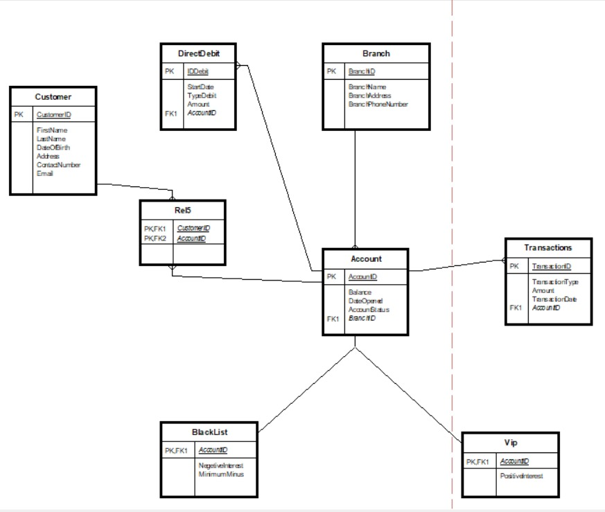

# databases

## Table of Contents

1. [Description of the Organization](#description-of-the-organization)
2. [Entity-Relationship Diagram (ERD)](#entity-relationship-diagram-erd)
3. [Data Structure Diagram (DSD)](#data-structure-diagram-dsd)
4. [Organization's Entities and Relationships](#organizations-entities-and-relationships)
5. [Third Normal Form (3NF)](#third-normal-form-3nf)
6. [Create Table Script](#create-table-script)
7. [Data Entry](#data-entry)
8. [Drop Table Script](#drop-table-script)
9. [Backup and Test](#backup-and-test)

## Description of the Organization

The organization under consideration is a banking institution known as XYZ Bank. XYZ Bank is a reputable financial institution with a wide range of services catering to individuals, businesses, and organizations. Established in [year], XYZ Bank has been serving customers for [number] years, providing comprehensive banking solutions, including savings and checking accounts, loans, investments, and financial advisory services.

XYZ Bank operates through a network of branches strategically located across [region/country], ensuring accessibility and convenience for its customers. With a strong focus on customer satisfaction, XYZ Bank prides itself on delivering exceptional banking experiences and personalized services to meet the diverse needs of its clientele.

In addition to its traditional banking services, XYZ Bank has embraced technological advancements to offer online banking platforms and mobile applications, allowing customers to manage their accounts, conduct transactions, and access banking services conveniently from anywhere, at any time.

Overall, XYZ Bank is committed to upholding the highest standards of integrity, professionalism, and innovation in the banking industry, striving to be the preferred financial partner for individuals and businesses alike.

## Entity-Relationship Diagram (ERD)

The Entity-Relationship Diagram (ERD) for the Accounts wing of XYZ Bank illustrates the entities and their relationships within the database schema.


.png>)

## Database Schema

### Customer

- The Customer entity represents the bank's customers who hold accounts with the bank.
  **Attributes:**
  - **CustomerID (Primary Key):** Unique identifier for the customer.
  - **FirstName:** First name of the customer.
  - **LastName:** Last name of the customer.
  - **DateOfBirth:** Date of birth of the customer.
  - **Address:** Address of the customer.
  - **ContactNumber:** Contact number of the customer.
  - **Email:** Email address of the customer.

### Account

- The Account entity represents the bank accounts held by customers.
  **Attributes:**
  - **AccountID (Primary Key):** Unique identifier for the account.
  - **Balance:** Current balance of the account.
  - **DateOpened:** Date when the account was opened.
  - **AccountStatus:** Status of the account (e.g., active, closed).

### Transaction

- The Transaction entity represents the transactions associated with customer accounts.
  **Attributes:**
  - **TransactionID (Primary Key):** Unique identifier for the transaction.
  - **AccountID (Foreign Key):** References the AccountID of the associated account.
  - **TransactionType:** Type of the transaction (e.g., deposit, withdrawal).
  - **Amount:** Amount involved in the transaction.
  - **TransactionDate:** Date when the transaction occurred.

### Branch

- The Branch entity represents the bank branches where customers can access banking services.
  **Attributes:**
  - **BranchID (Primary Key):** Unique identifier for the branch.
  - **BranchName:** Name of the branch.
  - **BranchAddress:** Address of the branch.
  - **BranchPhoneNumber:** Phone number of the branch.

### DirectDebit

- The DirectDebit entity represents the direct debit arrangements set up by customers for recurring payments.
  **Attributes:**
  - **IDDebit (Primary Key):** Unique identifier for the direct debit.
  - **StartDate:** Start date of the direct debit.
  - **TypeDebit:** Type of the direct debit.
  - **Amount:** Amount of the direct debit.
  - **IDAccount (Foreign Key):** References the AccountID of the associated account.
  - **IDBranch (Foreign Key):** References the BranchID of the associated branch.

### Vip (Inherits from Customer)

- The Vip entity represents VIP customers who have special privileges and benefits.
  **Attributes:**
  - Inherits all attributes from Customer.
  - **PositiveInterest:** Interest rate applied to VIP accounts.

### BlackList (Inherits from Customer)

- The BlackList entity represents customers who have been blacklisted due to certain reasons.
  **Attributes:**
  - Inherits all attributes from Customer.
  - **NegetiveInterest:** Interest rate applied to BlackList accounts.
  - **MinimumMinus:** Minimum balance allowed for BlackList accounts.

## Relationships

- **Customer and Account:** Many-to-Many (A customer can have multiple accounts and an account can belong to multiple customers).
- **Account and Transaction:** One-to-Many (An account can have multiple transactions but a transaction belongs to only one account).
- **Branch and Account:** One-to-Many (A branch can have multiple accounts but an account belongs to only one branch).
- **Account and DirectDebit:** One-to-Many (An account can have multiple direct debits but a direct debit belongs to only one account).
- **Customer** is the superclass of **Vip** and **BlackList**. These entities inherit attributes from the Customer entity.

## Data Structure Diagram (DSD)

The Data Structure Diagram (DSD) is derived from the Entity-Relationship Diagram (ERD) and represents the logical structure of the database. It outlines the tables, fields, and relationships in a hierarchical manner.



- **Customer**

  - Attributes:
    - CustomerID (PK)
    - FirstName
    - LastName
    - DateOfBirth
    - Address
    - ContactNumber
    - Email

- **Account**

  - Attributes:
    - AccountID (PK)
    - Balance
    - DateOpened
    - AccountStatus

- **Transaction**

  - Attributes:
    - TransactionID (PK)
    - AccountID (FK)
    - TransactionType
    - Amount
    - TransactionDate

- **Branch**

  - Attributes:
    - BranchID (PK)
    - BranchName
    - BranchAddress
    - BranchPhoneNumber

- **DirectDebit**

  - Attributes:
    - IDDebit (PK)
    - StartDate
    - TypeDebit
    - Amount
    - IDAccount (FK)
    - IDBranch (FK)

- **Rel5**

  - Attributes:
    - CustomerID (PK, FK1)
    - AccountID (PK, FK2)

- **Vip (Inherits from Customer)**

  - Attributes:
    - PositiveInterest

- **BlackList (Inherits from Customer)**
  - Attributes:
    - NegetiveInterest
    - MinimumMinus

## Relationships

- Customer to Account: M:M (via Rel5)
- Account to Transaction: 1:M
- Branch to Account: 1:M
- Account to DirectDebit: 1:M
- Customer to Vip and BlackList: Inheritance

## Third Normal Form (3NF)

By definition, schema R is in Third Normal Form (3NF) if for every X->Y in F, where F is the set of dependencies in R, one of the following holds:

- X is a superkey of R, or
- for each A in Y, either A is in X or A is an attribute in a key

Let's see for every schema:

- **Customer**

  - Dependencies:
    - CustomerID -> FirstName, LastName, Address, Email, DateOfBirth, ContactNumber

  CustomerID is a superkey of Customer. Conclusion: Customer is in 3NF.

- **Account**

  - Dependencies:
    - AccountID -> Balance, DateOpened, AccountStatus

  AccountID is a superkey of Account. Conclusion: Account is in 3NF.

- **Transaction**

  - Dependencies:
    - TransactionID -> TransactionType, TransactionDate, Amount, AccountID

  TransactionID is a superkey of Transaction. Conclusion: Transaction is in 3NF.

- **Branch**

  - Dependencies:
    - BranchID -> BranchName, BranchAddress, BranchPhoneNumber

  BranchID is a superkey of Branch. Conclusion: Branch is in 3NF.

- **DirectDebit**

  - Dependencies:
    - IDDebit -> StartDate, TypeDebit, Amount, IDAccount

  IDDebit is a superkey of DirectDebit. Conclusion: DirectDebit is in 3NF.

  ## Create Table Script

  ```sql
    --
    -- Target: Oracle 
    -- Syntax: sqlplus user@tnsnames_entry/password @filename.sql
    -- 
    -- Date  : May 20 2024 13:25
    -- Script Generated by Database Design Studio 2.21.3 
    --


    --
    -- Create Table    : 'Branch'   The Branch entity represents the bank branches where customers can access banking services.
    -- BranchID        :  
    -- BranchName      :  
    -- BranchAddress   :  
    -- BranchPhoneNumber :  
    --
    CREATE TABLE Branch (
        BranchID       NUMBER(38) NOT NULL,
        BranchName     VARCHAR2(20) NOT NULL,
        BranchAddress  VARCHAR2(20) NOT NULL,
        BranchPhoneNumber NUMBER NOT NULL,
    CONSTRAINT pk_Branch PRIMARY KEY (BranchID))
    /


    --
    -- Create Table    : 'Customer'   The Customer entity represents the bank's customers who hold accounts with the bank.
    -- CustomerID      :  
    -- FirstName       :  
    -- LastName        :  
    -- DateOfBirth     :  
    -- Address         :  
    -- ContactNumber   :  
    -- Email           :  
    --
    CREATE TABLE Customer (
        CustomerID     NUMBER(38) NOT NULL,
        FirstName      VARCHAR2(20) NOT NULL,
        LastName       VARCHAR2(20) NOT NULL,
        DateOfBirth    DATE NOT NULL,
        Address        VARCHAR2(20) NOT NULL,
        ContactNumber  NUMBER NOT NULL,
        Email          VARCHAR2(40) NOT NULL,
    CONSTRAINT pk_Customer PRIMARY KEY (CustomerID))
    /


    --
    -- Create Table    : 'Account'   The Account entity represents the bank accounts held by customers.
    -- AccountID       :  
    -- Balance         :  
    -- DateOpened      :  
    -- AccountStatus   :  
    -- BranchID        :  (references Branch.BranchID)
    --
    CREATE TABLE Account (
        AccountID      NUMBER(38) NOT NULL,
        Balance        NUMBER NOT NULL,
        DateOpened     DATE NOT NULL,
        AccountStatus  VARCHAR2(20) NOT NULL,
        BranchID       NUMBER(38),
    CONSTRAINT pk_Account PRIMARY KEY (AccountID),
    CONSTRAINT fk_Account FOREIGN KEY (BranchID)
        REFERENCES Branch (BranchID))
    /


    --
    -- Create Table    : 'Vip'   The Vip entity represents VIP customers who have special privileges and benefits.
    -- AccountID       :  (references Account.AccountID)
    -- PositiveInterest :  
    --
    CREATE TABLE Vip (
        AccountID      NUMBER(38) NOT NULL,
        PositiveInterest FLOAT NOT NULL,
    CONSTRAINT pk_Vip PRIMARY KEY (AccountID),
    CONSTRAINT fk_Vip FOREIGN KEY (AccountID)
        REFERENCES Account (AccountID))
    /


    --
    -- Create Table    : 'BlackList'   The BlackList entity represents customers who have been blacklisted due to certain reasons.
    -- AccountID       :  (references Account.AccountID)
    -- NegetiveInterest :  
    -- MinimumMinus    :  
    --
    CREATE TABLE BlackList (
        AccountID      NUMBER(38) NOT NULL,
        NegetiveInterest FLOAT NOT NULL,
        MinimumMinus   NUMBER NOT NULL,
    CONSTRAINT pk_BlackList PRIMARY KEY (AccountID),
    CONSTRAINT fk_BlackList FOREIGN KEY (AccountID)
        REFERENCES Account (AccountID))
    /


    --
    -- Create Table    : 'Rel5'   
    -- CustomerID      :  (references Customer.CustomerID)
    -- AccountID       :  (references Account.AccountID)
    --
    CREATE TABLE Rel5 (
        CustomerID     NUMBER(38) NOT NULL,
        AccountID      NUMBER(38) NOT NULL,
    CONSTRAINT pk_Rel5 PRIMARY KEY (CustomerID,AccountID),
    CONSTRAINT fk_Rel5 FOREIGN KEY (CustomerID)
        REFERENCES Customer (CustomerID)
        ON DELETE CASCADE,
    CONSTRAINT fk_Rel52 FOREIGN KEY (AccountID)
        REFERENCES Account (AccountID))
    /


    --
    -- Create Table    : 'DirectDebit'   The DirectDebit entity represents the direct debit arrangements set up by customers for recurring payments.
    -- IDDebit         :  
    -- StartDate       :  
    -- TypeDebit       :  
    -- Amount          :  
    -- IDAccount       :  
    -- IDBranch        :  
    -- AccountID       :  (references Account.AccountID)
    --
    CREATE TABLE DirectDebit (
        IDDebit        NUMBER(38) NOT NULL,
        StartDate      DATE NOT NULL,
        TypeDebit      VARCHAR2(20) NOT NULL,
        Amount         NUMBER NOT NULL,
        IDAccount      NUMBER(38) NOT NULL,
        IDBranch       NUMBER(38) NOT NULL,
        AccountID      NUMBER(38),
    CONSTRAINT pk_DirectDebit PRIMARY KEY (IDDebit),
    CONSTRAINT fk_DirectDebit FOREIGN KEY (AccountID)
        REFERENCES Account (AccountID))
    /


    --
    -- Create Table    : 'Transactions'   The Transaction entity represents the transactions associated with customer accounts.
    -- TransactionID   :  
    -- AccountID       :  
    -- TransactionType :  
    -- Amount          :  
    -- TransactionDate :  
    -- AccountID1      :  (references Account.AccountID)
    --
    CREATE TABLE Transactions (
        TransactionID  NUMBER(38) NOT NULL,
        AccountID      NUMBER(38) NOT NULL,
        TransactionType VARCHAR2(20) NOT NULL,
        Amount         NUMBER NOT NULL,
        TransactionDate DATE NOT NULL,
        AccountID1     NUMBER(38),
    CONSTRAINT pk_Transactions PRIMARY KEY (TransactionID),
    CONSTRAINT fk_Transactions FOREIGN KEY (AccountID1)
        REFERENCES Account (AccountID))
    /


    --
    -- Permissions for: 'public'
    --
    GRANT ALL ON Branch TO public
    /
    GRANT ALL ON Customer TO public
    /
    GRANT ALL ON Account TO public
    /
    GRANT ALL ON Vip TO public
    /
    GRANT ALL ON BlackList TO public
    /
    GRANT ALL ON Rel5 TO public
    /
    GRANT ALL ON DirectDebit TO public
    /
    GRANT ALL ON Transactions TO public
    /
  ```

  
  

