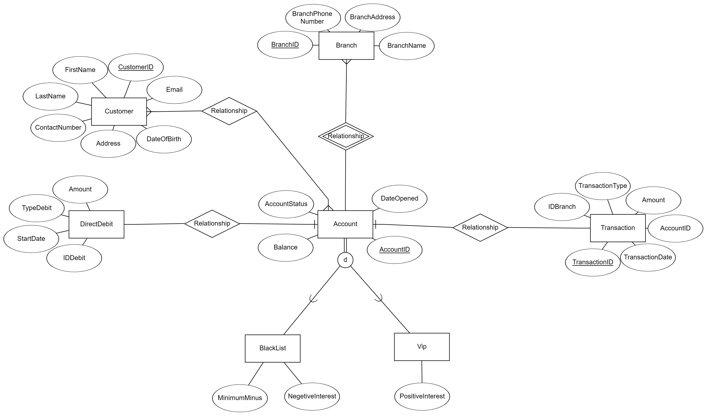

# databases

### Table of Contents

	1. [Description of the Organization](#description-of-the-organization)
	2. [Entity-Relationship Diagram (ERD)](#entity-relationship-diagram-erd)
	3. [Data Structure Diagram (DSD)](#data-structure-diagram-dsd)
	4. [Organization's Entities and Relationships](#organizations-entities-and-relationships)
	5. [Create Table Script](#create-table-script)
	6. [Data Entry](#data-entry)
	7. [Drop Table Script](#drop-table-script)
	8. [Backup and Test](#backup-and-test)

### Description of the Organization

The organization under consideration is a banking institution known as XYZ Bank. XYZ Bank is a reputable financial institution with a wide range of services catering to individuals, businesses, and organizations. Established in [year], XYZ Bank has been serving customers for [number] years, providing comprehensive banking solutions, including savings and checking accounts, loans, investments, and financial advisory services.

XYZ Bank operates through a network of branches strategically located across [region/country], ensuring accessibility and convenience for its customers. With a strong focus on customer satisfaction, XYZ Bank prides itself on delivering exceptional banking experiences and personalized services to meet the diverse needs of its clientele.

In addition to its traditional banking services, XYZ Bank has embraced technological advancements to offer online banking platforms and mobile applications, allowing customers to manage their accounts, conduct transactions, and access banking services conveniently from anywhere, at any time.

Overall, XYZ Bank is committed to upholding the highest standards of integrity, professionalism, and innovation in the banking industry, striving to be the preferred financial partner for individuals and businesses alike.

### Entity-Relationship Diagram (ERD)

The Entity-Relationship Diagram (ERD) for the Accounts wing of XYZ Bank illustrates the entities and their relationships within the database schema.

#### Description of Entities:

1. **Account (Regular Entity)**: 
   - The `Account` entity represents the bank accounts themselves. 
   - Attributes include:
     - `AccountID` (primary key): Unique identifier for the account.
     - `AccountType`: Type of the account (e.g., checking, savings).
     - `Balance`: Current balance of the account.
     - `DateOpened`: Date when the account was opened.
     - `AccountStatus`: Status of the account (e.g., active, closed).

2. **Customer (Regular Entity)**: 
   - The `Customer` entity represents the customers who own the accounts.
   - Attributes include:
     - `CustomerID` (primary key): Unique identifier for the customer.
     - `FirstName`: First name of the customer.
     - `LastName`: Last name of the customer.
     - `DateOfBirth`: Date of birth of the customer.
     - `Address`: Address of the customer.
     - `ContactNumber`: Contact number of the customer.
     - `Email`: Email address of the customer.

3. **Transaction (Regular Entity)**: 
   - The `Transaction` entity represents transactions made on an account.
   - Attributes include:
     - `TransactionID` (primary key): Unique identifier for the transaction.
     - `AccountID`: Foreign key referencing the account involved in the transaction.
     - `TransactionType`: Type of the transaction (e.g., deposit, withdrawal).
     - `Amount`: Amount involved in the transaction.
     - `TransactionDate`: Date when the transaction occurred.

4. **Branch (Regular Entity)**: 
   - The `Branch` entity represents the bank branches where the accounts are held.
   - Attributes include:
     - `BranchID` (primary key): Unique identifier for the branch.
     - `BranchName`: Name of the branch.
     - `BranchAddress`: Address of the branch.
     - `BranchPhoneNumber`: Phone number of the branch.

5. **Employee (Regular Entity)**: 
   - The `Employee` entity represents the bank employees who manage the accounts.
   - Attributes include:
     - `EmployeeID` (primary key): Unique identifier for the employee.
     - `FirstName`: First name of the employee.
     - `LastName`: Last name of the employee.
     - `Position`: Position of the employee within the bank.
     - `BranchID`: Foreign key referencing the branch where the employee works.

6. **AccountOwner (Associative Entity)**: 
   - The `AccountOwner` entity is an associative entity that links the `Customer` and `Account` entities, representing the ownership of accounts by customers.
   - Attributes include:
     - `CustomerID`: Foreign key referencing the customer who owns the account.
     - `AccountID`: Foreign key referencing the account owned by the customer.
     - `DateAccountOpened`: Date when the account was opened by the customer.

#### Description of Relationships:

- **Account-Customer (M:N)**: Each account can have multiple customers, and each customer can have multiple accounts.
- **Transaction-Account (1:N)**: Each transaction is associated with one account, but an account can have multiple transactions.
- **Employee-Branch (1:N)**: Each employee works at one branch, but each branch can have multiple employees.
- **Account-Branch (1:N)**: Each account is associated with one branch, but a branch can have multiple accounts.
- **Employee-Account (1:N)**: Each employee manages multiple accounts, but each account is managed by one employee.
- **AccountOwner-Customer (1:M)**: Each account is owned by one customer, but each customer can own multiple accounts.

### Data Structure Diagram (DSD)

The Data Structure Diagram (DSD) is derived from the Entity-Relationship Diagram (ERD) and represents the logical structure of the database. It outlines the tables, fields, and relationships in a hierarchical manner.

[Insert DSD image here]

You can include the DSD image to visually represent the database structure. Adjust the explanations and relationships according to your specific requirements. Let me know if you need further clarification or assistance!
